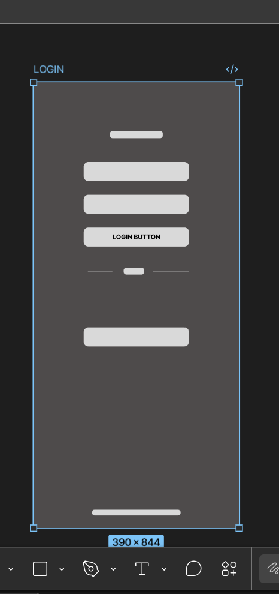
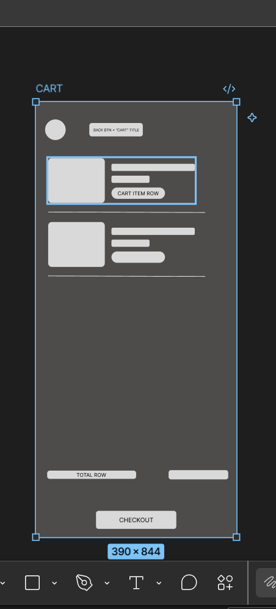
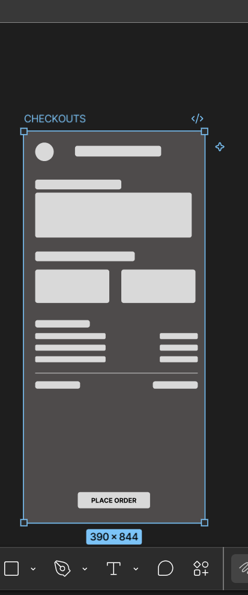

# ECCOMERCE-App-Wireframes
## Objective
Low-fidelity visual schematics aur user flow paths banaye gaye 
hain ek custom e-commerce mobile application ke liye, Figma 
tool ka use karke.

## Tools Used
- Figma

## User Persona
**Name:** Sara Ahmed, 22 year, University Student  
**Goal:** Searching Affordable products online  , fast checkout , easy cart system  
**Pain Point:**  preventaion from lenghty chechout

## User Flow
Splash Screen → Login/Signup → Home Dashboard → Search/Filters 
→ Product Listing → Product Detail → Cart → Checkout → 
Order Confirmed

## Wireframe Screens

### 1. Splash Screen

### 2. Login / Signup

### 3. Home Dashboard

### 4. Search / Filters

### 5. Product Listing

### 6. Product Detail

### 7. Cart

### 8. Checkout

### 9. Order Confirmed

## Figma File Link
[Click here to view full Figma project](https://www.figma.com/design/1570YrStshy3zXdLwNHVWw/Untitled?node-id=76-8&t=LBnmd3nib6vo4Rq1-1)open [page 3 in the link]
